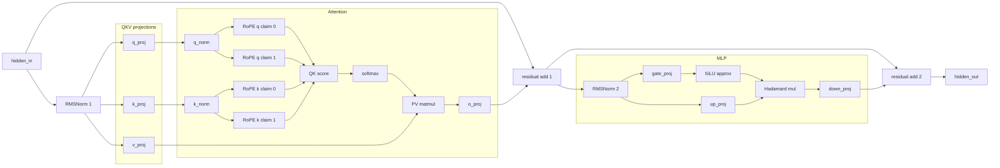

# qwen3-layer-prover

This crate proves and verifies one independent Qwen3 decoder-layer transition.

Start here:

1. `src/layer/mod.rs`
   - module guide and public exports.
2. `src/layer/prover.rs`
   - complete proving boundary: witness, commitments, IOP, openings.
3. `src/layer/verifier.rs`
   - verification boundary matching `prover.rs`.
4. `src/layer/iop.rs`
   - hand-written layer equations and reverse claim flow. No PCS code here.
5. `src/layer/commitments.rs`
   - committed polynomial construction and transcript binding.
6. `src/layer/openings.rs`
   - adapter into `jolt_atlas_core::opening_reduction`.
7. `src/layer/witness.rs` and `src/layer/tensors.rs`
   - witness views and op parameter wiring details.

Experiment records are kept under `benches/`. They are historical data, not the
current code path.

## Command

```bash
cargo run --release -p qwen3-layer-prover --bin prove_trace_layer -- \
  --trace qwen3-awy/traces/fox_eos_full_awy \
  --model qwen3-awy/models/qwen3-0.6b/model.safetensors \
  --layer 0
```

## Layer Flow


